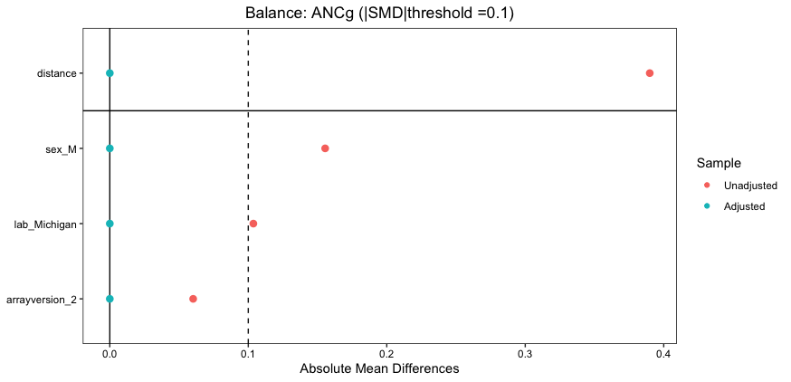
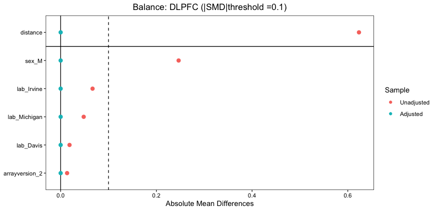
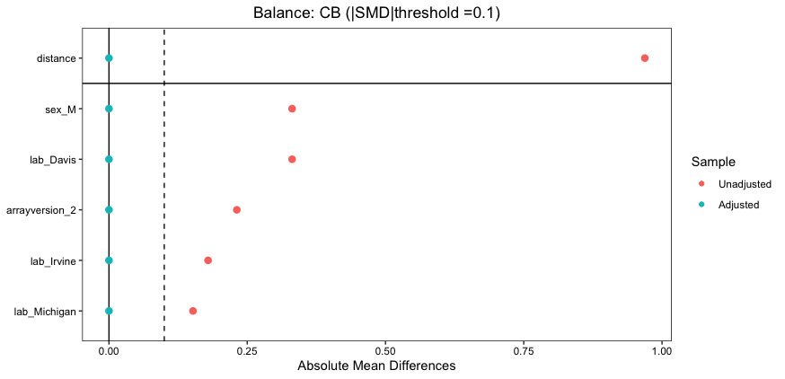
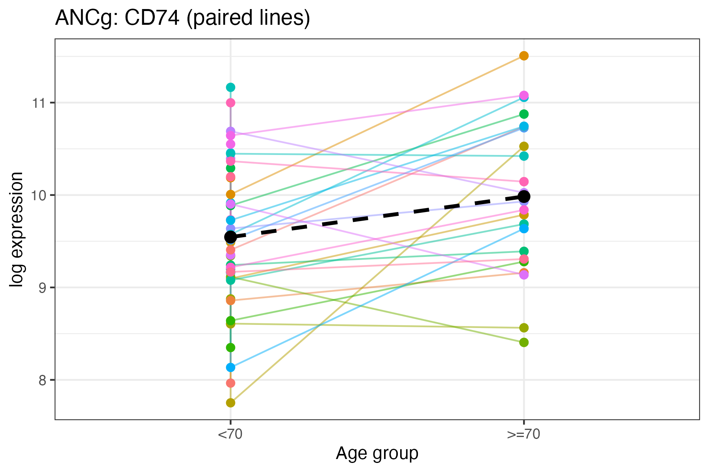
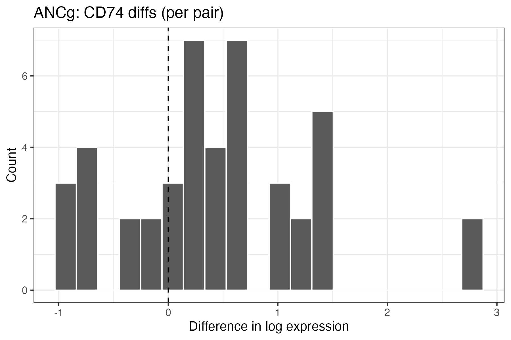
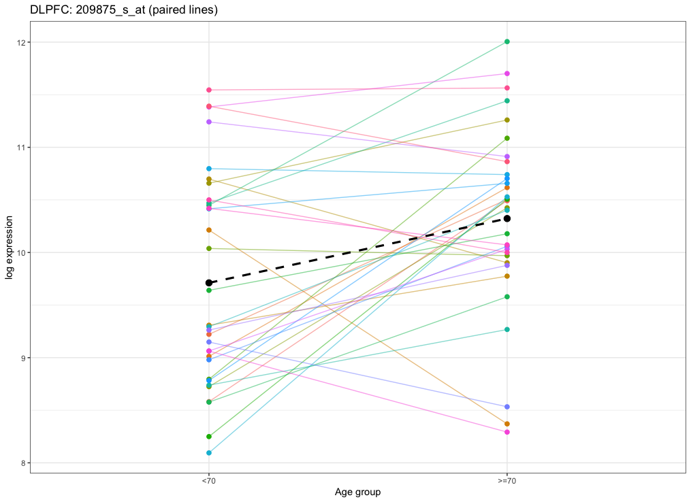
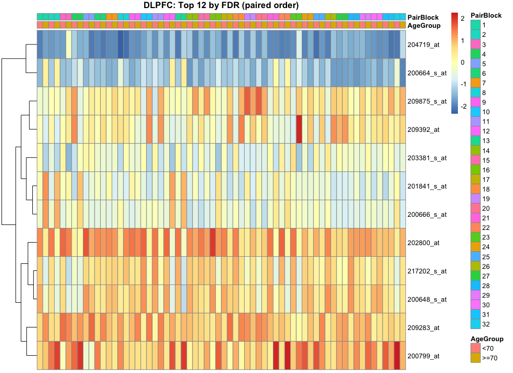
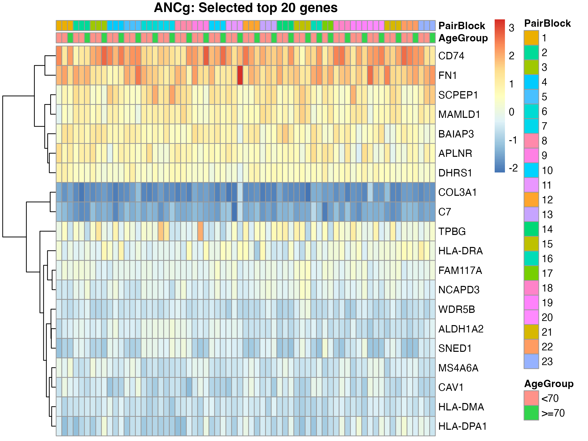
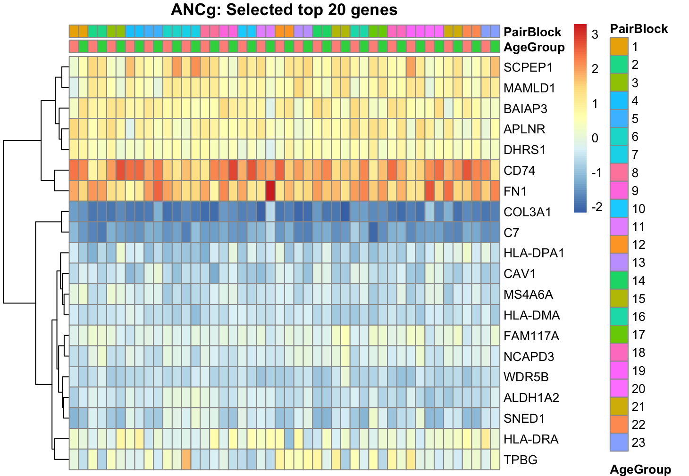

# Pair Matching Analysis

To validate our findings through previous methods and visually confirm the age-related expression patterns identified through regression models, we implemented a propensity score matching approach.
This method serves two main purposes:
	1.	To check the robustness of our regression-based findings under a non-parametric framework.
	2.	To provide an intuitive visualization of gene expression changes that can be easily interpreted by collaborators with limited statistical background.

<!-- 
## Data Preparation 
	<!-- •	The dataset includes gene expression measurements across three brain regions:
	•	Anterior cingulate cortex (ANCg) 
	•	Dorsolateral prefrontal cortex (DLPFC)
	•	Cerebellum (CB)
	•	Each sample also has metadata: sex, lab, arrayversion, and age group (≥70 vs <70).
	•	Matching was conducted within each brain region to preserve biological context. --> 

## Matching Procedure

### 1. Propensity score estimation

- A logistic regression model was used to estimate the probability of being in the older age group (≥70) as a function of the confounding variables:

$$
\operatorname{logit}\big(\Pr(\text{AgeGroup}=1)\big)
\;=\; \beta_0 
\;+
\; \beta_1\,\text{sex}
\;+
\; \beta_2\,\text{lab}
\;+
\; \beta_3\,\text{arrayversion}
$$

- This model produced a propensity score for each sample.

### 2. 1:2 Nearest-Neighbor Matching

- Each older individual was matched to two younger individuals with the closest propensity scores (nearest neighbor).
- Matching was done without replacement to maintain balance.
- Caliper (maximum distance tolerance) was selected based on standardized mean differences to ensure acceptable covariate balance.

### 3. Balance Assessment

- After matching, we evaluated covariate balance using standardized mean differences (SMD). A threshold of |SMD| < 0.1 was considered acceptable.

### Balance plots (by region)

 These plots summarize standardized mean differences (SMD) after matching for `sex`, `lab`, and `arrayversion` separately in `ANCg`, `DLPFC` and `CB` brain regions. The balance plots show that after matching, the differences in sex, lab, and array version were completely eliminated (all standardized mean differences = 0). Although the overall dataset remains unbalanced and some information is inevitably lost during matching, the resulting covariate balance indicates that the matching procedure effectively created comparable groups. Therefore, the matching analysis can be viewed as a meaningful validation step and a useful complementary tool to support and interpret the regression-based findings.

Paired Comparison of Expression
	1.	Within each matched set (1 older sample + 2 younger samples), we computed pairwise differences in log-transformed expression levels.
\Delta_{ij} = \text{Expr}{\text{older},i} - \text{Expr}{\text{younger},j}
	2.	For each gene, the mean difference across matched pairs was summarized.
	3.	We visualized results through:
	•	Paired line plots, connecting each matched pair’s expression across age groups.
	•	Histograms of pairwise differences, to display the distribution and direction of age-related effects.

### Example paired comparisons and distributions

#### ANCg (example genes — CD74)

Paired lines and per-pair differences for the representative gene `CD74`:

_Analysis (paired lines)_: Each line connects matched samples (<70 vs ≥70). A consistent up/down slope across pairs indicates a coherent age-associated change; crossing or flat lines suggest heterogeneity or weak effects.

_Analysis (pairwise differences)_: Distribution centered above/below zero indicates direction of the age effect; spread reflects variability across pairs. Narrow spread implies robust effect across matches.

#### Region-level summaries

_Analysis_: Global paired-line view across `DLPFC`. Coherent direction across many pairs supports region-level age effects; scattered or opposing trends suggest heterogeneity.

_Analysis_: Heatmap highlights concordant up/down differences across pairs and genes. Block-like patterns indicate consistent signatures; noisy patterns imply modest effects.

_Analysis_: Top `ANCg` genes post-matching. Consistent color direction across rows/columns indicates a robust age-associated signature in this region.

<!-- 

_Analysis_: Ranked `ANCg` signals for broader context. Use alongside FDR-regression results to confirm agreement in both sign and magnitude. -->

⸻

Interpretation
	•	If regression results were reliable, matched-pair differences should display consistent directional trends (e.g., most pairs showing higher expression in the older group).
	•	Indeed, the paired plots showed upward trends for several top candidate genes (such as those identified with low FDR values).
	•	This agreement between regression and matching analyses supports the robustness of our findings.
	•	Furthermore, these plots provide a more intuitive presentation for biological collaborators, demonstrating visible evidence of differential expression beyond model-based inference.

⸻

Summary
	•	Matching type: Propensity score matching (1:2 nearest neighbor, within region)
	•	Matched on: sex, lab, arrayversion
	•	Purpose: Robustness check and interpretability enhancement
	•	Validation outcome: Direction of gene expression differences consistent with regression results
	•	Visualization: Balance plots, paired line plots, and histograms of matched-pair differences